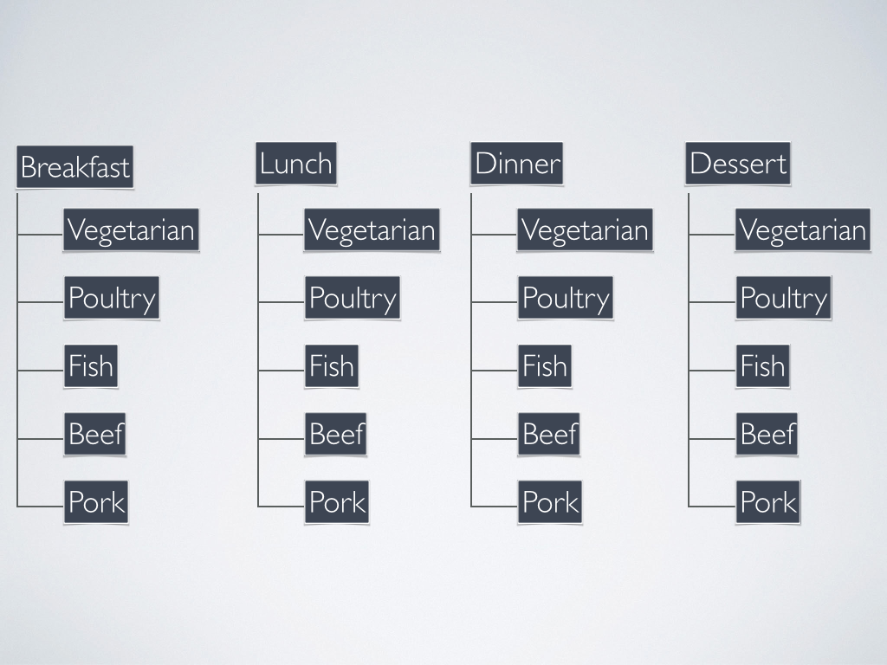
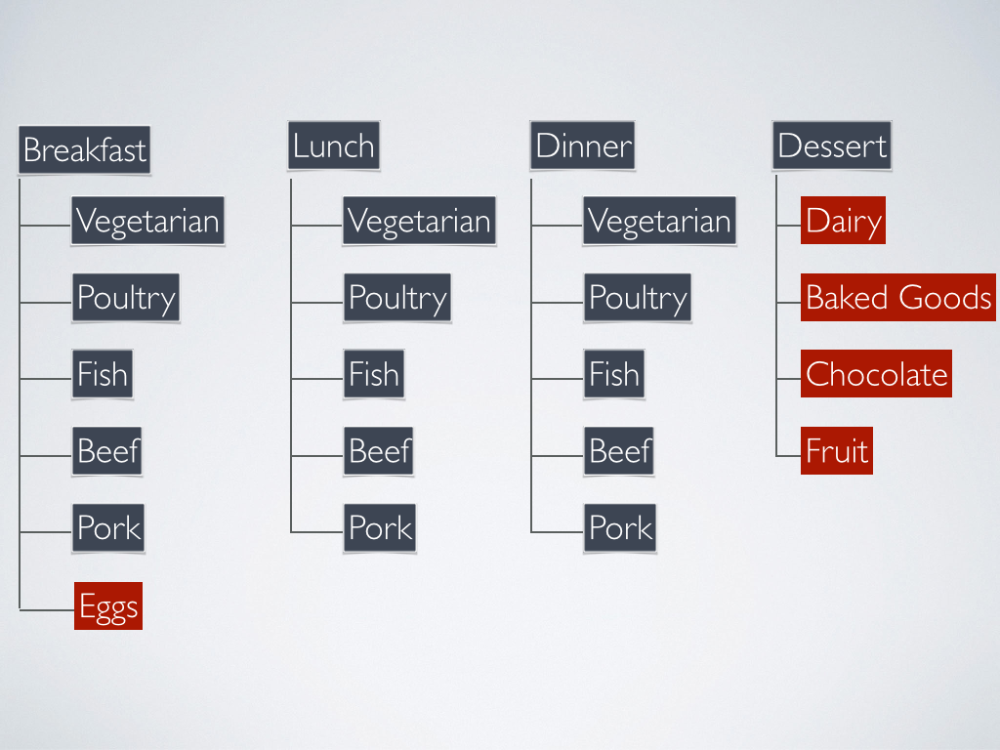
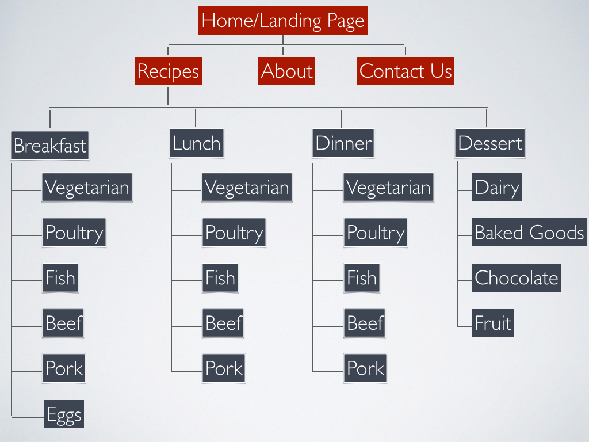

# Information Architecture

Before building a site, we need think about our pages. Not just how content is organized on a page, but also how information is organized site wide. We do this with a sitemap. A sitemap is often the first visual presented to a client. The site map helps define how a user would navigate a site and its information. It also helps the developer plan how to build out the site structure, and the designer start to plan out what content will be on each page.

Let's pretend our client wants a recipe website. The first thing we need to do is build out a sitemap. Recipes always present an interesting information architecture challenge: How will I organize/group/classify all of these recipes?

* By ingredient? (chicken, beef, cheese, vegetarian)
* By course? (breakfast, snack, lunch, dinner)
* By country of origin? (Mexican, Chinese, French)
* By method of preparation? (slow cooker, bbq, baking, frying)

All of these are valid ways to group recipes right? But what about grouping recipes within a group of recipes? Lets say our recipe site is pretty simple, and we choose to first group our recipes by course.

* Breakfast
* Lunch
* Dinner
* Dessert

Then each course would then be subdivided again by main ingredient:

* Vegetarian
* Poultry
* Fish
* Beef
* Pork

What might that look like in our site map?

Wait a minute! Maybe the using the same subcategories for all meals doesn’t work. We probably aren’t eating fish for dessert right? We probably need an eggs category for breakfast, dessert needs an entirely different set of sub categories.

but wait! This is a website. We probably need a homepage to wrap this all up. We can have, but don’t NEED an about and a contact page, but lets throw them in as some top level categories.

Now at this point, we can and should continue to think about how individual recipes wind up in each subcategory. Is there a sub-sub-category? We won’t go there today, but just know that we can and should!

Also, it is worth noting that these diagrams can be made with any software you are comfortable with. You could use keynote, powerpoint, balsamiq or another wire framing software. Even illustrator or photoshop are good options, but remember – the information architecture of your site map is more important than the color of the box around the text! You can also sketch these out if you are more comfortable with that as a first step. A text only outline is also helpful for many reasons. Its also super quick!

##HOME
---
###ABOUT
###CONACT
###RECIPES
---
####Breakfast
* Vegetarian
* Poultry
* Fish
* Beef
* Pork
* Eggs

---

####Lunch
* Vegetarian
* Poultry
* Fish
* Beef
* Pork

---

####Dinner
* Vegetarian
* Poultry
* Fish
* Beef
* Pork

----

####Dessert
* Dairy
* Baked Goods
* Chocolate
* Fruit