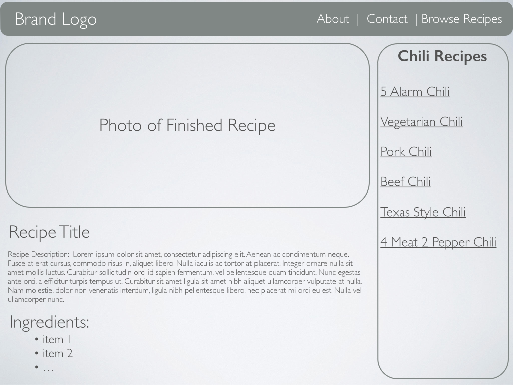
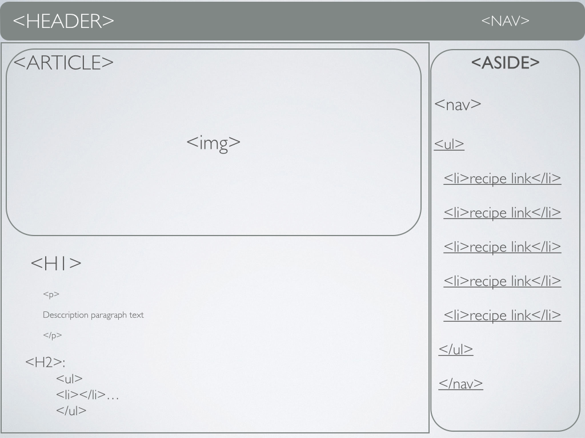

# User Experience

> User Experience (UX) involves a person’s emotions and attitudes about using a particular product, system or service.

– wikipedia

There are UX researchers, designers, and developers.

*User Experience = Human Interaction with a product.*

[Information Architecture](../Information_Architecture) is an important aspect of UX.

**For example:**

* How many clicks does it take to get to the product a client needs to buy?
* If a client has a hard time finding what they are looking for on their site, they probably won’t stay long, and they probably won’t return.
*Individual page and site wireframes are also important to UX*

* Is the call to action (usually a learn more or buy now button) clearly visible and appropriately placed?
* Is individual page navigation intuitive and is content organized in a way that makes sense to the client?
* We can test a Site or Page UX with Wireframes.

## What is a Wireframe?

>A website wireframe, also known as a page schematic or screen blueprint, is a visual guide that represents the skeletal framework of a website.

– Brown, Dan M. (2011). Communicating Design: Developing Web Site Documentation for Design and Planning (2nd ed.). New Riders Press. ISBN 978-0321712462.

* The focus is on organizing content, not picking colors and images.
* Wireframes are given to the developers, so they know what structure they need to build for each page.
* Wireframes are also given to designers, to have guidelines of where they need to place different assets on each page in their designs.
* Wireframes are used early on to test interaction with focus groups. (UX Research)

### Wireframes are the jumping off point for:

* Client approval
* User Testing
* Back End (database) developers
* Front End developers
* Designers

### So what might a Wireframe Look like For a single recipe page?



We’d probably need to then organize how the instructions for preparation are displayed. And decide if additional how to photos are included right?

We should also have a footer with some quick links and copyright info, maybe even links to the recipe company’s social media accounts.

## Semantic HTML | HTML 5

We’ve been talking a lot about headers, navigation, sections, asides and footers right? Wouldn’t it be nice if there were some HTML elements to help up wrap up and group these different kinds of content?

Well, there is. HTML5 has new(er) tags that helps us do that!

W3 Schools:

> A semantic element clearly describes its meaning to both the browser and the developer.

Examples of *non-semantic* elements: `<div>` and `<span>` – Tells nothing about its content.

Examples of *semantic* elements: `<form>`, `<table>`, and `` – Clearly defines its content.

This will all make a little more sense when we start styling our content next class, but let’s take a look at some of the new tags.

Semantic HTML Elements:

```
<article>
<aside>
<details>
<figcaption>
<figure>
<footer>
<header>
<main>
<mark>
<nav>
<section>
<summary>
<time>
```



Whoa that was easy right? Between a clear wireframe of how the page is laid out from our UX designer and some semantic HTML we have a pretty clear grasp on what we need to build. We also have some information about spacing and layout we can use next when we apply CSS Styles next class.

### Divs and Spans

What if we just need a box?

What if that box needs to take up space but doesn’t need to be classified as an article or a section. We just need it for layout purposes?

What if we want to color one sentence in a paragraph a different color?

We can use `<div></div>` for generic division of content. 

```html
<div>
	
	<p> This is a paragraph about the image.</p>
</div>
```

We can use `<span></span>` for grabbing some subsection of a paragraph or other text.

```html
<p>This is a paragraph. <span>This sentence is will be separated by a span tag so we can turn it red with css next class.</span></p>
```
Divs and Spans are non-semantic elements. We will talk next week about the difference between `block` `inline-block` and `inline` elements when we start tackling css layouts.

